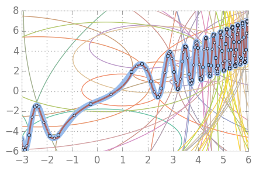

This is a take on solving a problem of approximating arbitrary functions with as few circular arcs as possible.

The problem appears in [Computer-aided manufacturing](https://en.wikipedia.org/wiki/Computer-aided_manufacturing) and such.

I am using [Julia](https://julialang.org/) programming language inside [Jupyter Notebook](http://jupyter.org/).

More details are in the corresponding [blog post](http://blog.ruslans.com/2015/02/interpolating-functions-via-circular.html).
